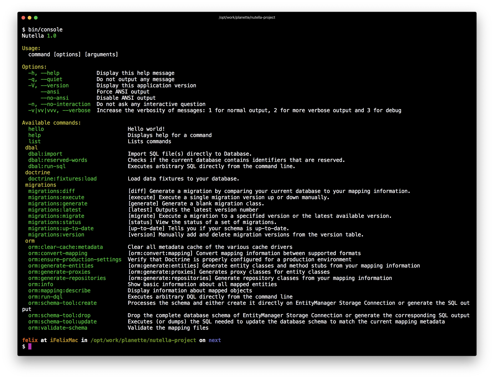

<p align=center>
  <a href="https://github.com/contributte/doctrine-migrations/actions"></a>
  <a href="https://codecov.io/gh/contributte/doctrine-migrations"></a>
  <a href="https://packagist.org/packages/nettrine/migrations"></a>
  <a href="https://packagist.org/packages/nettrine/migrations"></a>
</p>
<p align=center>
  <a href="https://packagist.org/packages/nettrine/migrations"></a>
  <a href="https://github.com/contributte/doctrine-migrations"></a>
  <a href="https://bit.ly/ctteg"></a>
  <a href="https://bit.ly/cttfo"></a>
  <a href="https://contributte.org/partners.html"></a>
</p>

<p align=center>
Website 🚀 <a href="https://contributte.org">contributte.org</a> | Contact 👨🏻‍💻 <a href="https://f3l1x.io">f3l1x.io</a> | Twitter 🐦 <a href="https://twitter.com/contributte">@contributte</a>
</p>

Integration of [Doctrine Migrations](https://www.doctrine-project.org/projects/migrations.html) for Nette Framework.

## Versions

| State       | Version | Branch   | Nette  | PHP     |
|-------------|---------|----------|--------|---------|
| dev         | `^0.11` | `master` | `3.2+` | `>=8.2` |
| stable      | `^0.10` | `master` | `3.2+` | `>=8.2` |

## Contents

- [Installation](#installation)
- [Configuration](#configuration)
- [Usage](#usage)
- [DBAL & ORM](#dbal--orm)
- [Examples](#examples)
- [Development](#development)

## Installation

To install latest version of `nettrine/migrations` use [Composer](https://getcomposer.org).

```bash
composer require nettrine/migrations
```

Register prepared [compiler extension](https://doc.nette.org/en/dependency-injection/nette-container) in your `config.neon` file.

```neon
extensions:
    nettrine.migrations: Nettrine\Migrations\DI\MigrationsExtension
```

> [!NOTE]
> This is just **Migrations**, for **ORM** use [nettrine/orm](https://github.com/contributte/doctrine-orm) or **DBAL** use [nettrine/dbal](https://github.com/contributte/doctrine-dbal).

## Configuration

### Minimal configuration

```neon
nettrine.migrations:
  directories:
    App\Migrations: %appDir%/migrations
```

### Advanced configuration

Here is the list of all available options with their types.

```yaml
nettrine.migrations:
  table: <string>
  column: <string>
  directories: array<string, string>
  versionsOrganization: <null|year|year_and_month>
  customTemplate: <null|path>
  allOrNothing: <bool>

  migrationFactory: <service>
  logger: <service>
  connection: <string>
  manager: <string>
```

**Multiple databases**

```php
$this->configurator->addDynamicParameters([
	'env' => getenv(),
]);
```

```neon
nettrine.migrations:
  directories:
    App\Migrations: %appDir%/migrations
  connection: %env.DATABASE_CONNECTION%
```

## Usage

Type `bin/console` in your terminal and there should be a `migrations` command group.

- `migrations:diff`
- `migrations:execute`
- `migrations:generate`
- `migrations:latest`
- `migrations:migrate`
- `migrations:status`
- `migrations:up-to-date`
- `migrations:version`

You are mostly going to need `migrations:diff` and `migrations:migrate`.

### Migration

You can create a new migration by running the following command.

```bash
bin/console migrations:generate
```

In the migration file, you can use [dependency injection](https://doc.nette.org/en/3.0/dependency-injection). Injecting into properties or via `inject<>` method is also supported.

```php
<?php declare(strict_types = 1);

namespace App\Migrations;

use Doctrine\DBAL\Schema\Schema;
use Doctrine\Migrations\AbstractMigration;
use Nette\DI\Attributes\Inject;

final class Version20200000000001 extends AbstractMigration
{

  #[Inject]
  public DummyService $dummy;

  public function up(Schema $schema): void
  {
    $this->addSql('CREATE TABLE happy (id INT NOT NULL, coding INT NOT NULL, PRIMARY KEY(id))');
  }

}
```

## DBAL & ORM

> [!TIP]
> Doctrine Migrations needs a database connection and entities information.
> Take a look at [nettrine/dbal](https://github.com/contributte/doctrine-dbal) and [nettrine/orm](https://github.com/contributte/doctrine-orm).

```bash
composer require nettrine/dbal
composer require nettrine/orm
```

### Console

> [!TIP]
> Doctrine DBAL needs Symfony Console to work. You can use `symfony/console` or [contributte/console](https://github.com/contributte/console).

```bash
composer require contributte/console
```

```neon
extensions:
  console: Contributte\Console\DI\ConsoleExtension(%consoleMode%)

  nettrine.dbal: Nettrine\DBAL\DI\DbalExtension
```

Since this moment when you type `bin/console`, there'll be registered commands from Doctrine DBAL.



## Examples

> [!TIP]
> Take a look at more examples in [contributte/doctrine](https://github.com/contributte/doctrine/tree/master/.docs).

## Development

See [how to contribute](https://contributte.org) to this package. This package is currently maintained by these authors.

<a href="https://github.com/f3l1x">
    
</a>

-----

Consider to [support](https://contributte.org/partners.html) **contributte** development team.
Also thank you for using this package.
